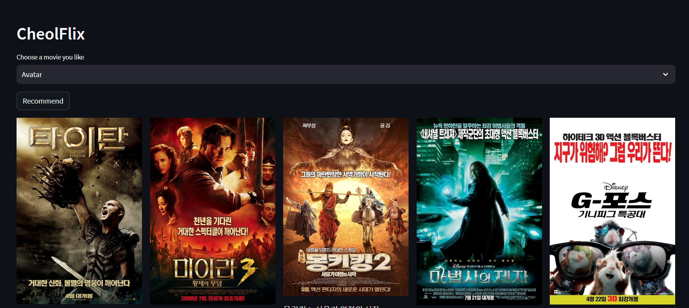

# 유튜브 / 나도코딩 넷플릭스 클론 코딩 

* 개요 
  * 미니 프로젝트 
  * 머신러닝,딥러닝을 통해 영화이름,감독 등 유사성을 찾아 영화를 추천해주는 컨텐츠를 기획
  * Python - sklearn metrics pairwise linear_kernel 사용 

-----
 
* 사용 코드 기록
```python
from sklearn.feature_extraction.text import TfidfVectorizer
tfidf = TfidfVectorizer(stop_words = 'english')

from sklearn.feature_extraction.text import ENGLISH_STOP_WORDS
ENGLISH_STOP_WORDS #거를 단어들을 선정

# 단어 유사도 판단
# 코사인 유사도 사용
from sklearn.metrics.pairwise import linear_kernel

cosine_sim = linear_kernel(tfidf_matrix,tfidf_matrix)
```

추후 학습된 모델을 통하여 함수를 이용한 정제 작업 완료 

```python 
def get_recommendations(title,cosine_sim=cosine_sim):
  idx = indices[title]
  sim_scores =list(enumerate(cosine_sim[idx])) #코사인 유사도 매트릭스에서 idx에 해당하는 데이터를 (idx 유사도) 형태로 얻기
  sim_scores = sorted(sim_scores, key = lambda x : x[1],reverse=True) # 코사인 유사도 정렬 내림 차순
  sim_scores = sim_scores[1:11] # 자기자신을 제외한 10개의 추천 영화를 슬라이싱
  movie_indices = [i[0] for i in sim_scores]
  return df2['title'].iloc[movie_indices]
```

----

## VSCODE 작업 

```python
def get_recommendations(title):
   
   idx = movies[movies['title']== title].index[0]
   sim_scores = list(enumerate(cosine_sim[idx]))
   #코사인 유사도 매트릭스에서 idx에 해당하는 데이터를 (idx 유사도) 형태로 얻기 
   sim_scores = sorted(sim_scores, key = lambda x : x[1],reverse=True) # 코사인 유사도 정렬 내림 차순 
   sim_scores = sim_scores[1:11] # 자기자신을 제외한 10개의 추천 영화를 슬라이싱
   movie_indices = [i[0] for i in sim_scores] 
   images = []
   titles = []

   for i in movie_indices:
       id = movies['id'].iloc[i]
       details = movie.details(id) 
       image_path = details['poster_path']
      
       if image_path:
        image_path = 'https://image.tmdb.org/t/p/w500' + image_path
       else: 
        image_path = 'no_image.jpg' # 영화를 직접 검색 했을 때 추천 영화에는 있으나 포스터가 없을 경우 
        
       images.append(image_path)
       titles.append(details['title'])
    
   return images,titles 

movies = pickle.load(open('movies.pickle','rb'))
cosine_sim = pickle.load(open('cosine_sim.pickle','rb'))

st.set_page_config(layout='wide')

# 헤더 
st.header('CheolFlix')
movie_list = movies['title'].values 
title = st.selectbox('Choose a movie you like',movie_list) #

if st.button('Recommend'):
    with st.spinner('Please wait...'):
        images, titles = get_recommendations(title)

        idx = 0 # 
        for i in range(0,2):
            cols = st.columns(5) # 5개 컬럼 생성 
            for col in cols:
                col.image(images[idx])
                col.write(titles[idx])
                idx += 1 
```

---- 


* ### 결과물 

****